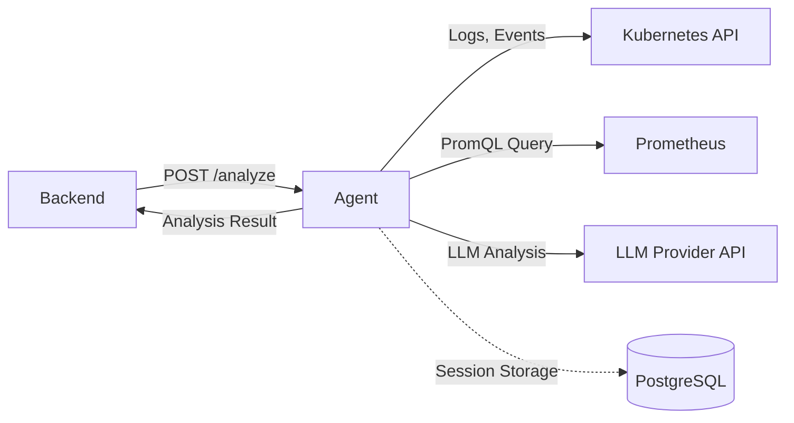

<p align="center">
  
</p>

<h1 align="center">KubeRCA Agent</h1>

<p align="center">
  <strong>AI-Powered Analysis Service for Kubernetes Incidents</strong>
</p>

<p align="center">
  
  
  
  
</p>

---

## Overview

The KubeRCA Agent is a Python-based analysis service that performs Root Cause Analysis (RCA) on Kubernetes incidents. It receives alert payloads from the Backend, collects relevant context from the Kubernetes cluster and Prometheus, and uses LLM via Strands Agents (Gemini/OpenAI/Anthropic) to generate comprehensive analysis reports.

### Key Features

- **AI-Powered RCA** - Uses Strands Agents with Gemini/OpenAI/Anthropic for intelligent analysis
- **Kubernetes Context** - Collects pod logs, events, and resource status
- **Prometheus Integration** - Queries relevant metrics for analysis
- **Session Persistence** - Optional PostgreSQL storage for conversation history
- **Fallback Mode** - Returns basic summary when the provider API key is unavailable

---

## Architecture



### Analysis Flow

1. Receive alert payload from Backend
2. Collect Kubernetes context (logs, events, pod status)
3. Query Prometheus for relevant metrics
4. Build analysis prompt with collected context
5. Send to Strands Agents (Gemini/OpenAI/Anthropic) for RCA
6. Return structured analysis result

---

## Tech Stack

| Category | Technology |
|----------|------------|
| **Language** | Python 3.10+ |
| **Framework** | FastAPI |
| **AI/LLM** | Strands Agents (Gemini/OpenAI/Anthropic) |
| **Package Manager** | uv |
| **Linting** | ruff |
| **Testing** | pytest |
| **Container** | Docker |
| **CI/CD** | GitHub Actions |

---

## Quick Start

### Prerequisites

- Python 3.10+
- uv (Python package manager)
- (Optional) Kubernetes cluster access
- (Optional) AI provider API key

### Installation

```bash
cd agent
make install
# or manually:
uv venv
source .venv/bin/activate
uv pip install -e ".[dev]"
```

### Run Development Server

```bash
make run
# or manually:
uvicorn app.main:app --host 0.0.0.0 --port 8000 --reload
```

The server starts at `http://localhost:8000`.

### Run Tests

```bash
make test
# or:
pytest
```

### Lint & Format

```bash
make lint    # Check code style
make format  # Auto-format code
```

---

## API Endpoints

| Method | Endpoint | Description |
|--------|----------|-------------|
| GET | `/` | Service info |
| GET | `/ping` | Health check |
| GET | `/healthz` | Kubernetes health probe |
| POST | `/analyze` | Analyze single alert |
| POST | `/summarize-incident` | Summarize resolved incident |
| GET | `/openapi.json` | OpenAPI specification |

### POST /analyze

Analyzes a single alert with Kubernetes/Prometheus context.

**Request:**
```json
{
  "alert": {
    "status": "firing",
    "labels": {
      "alertname": "HighMemoryUsage",
      "severity": "critical",
      "namespace": "default",
      "pod": "example-pod"
    },
    "annotations": {
      "summary": "High memory usage detected",
      "description": "Pod memory usage > 90%"
    },
    "startsAt": "2024-01-01T00:00:00Z",
    "fingerprint": "abc123"
  },
  "thread_ts": "1234567890.123456"
}
```

**Response:**
```json
{
  "status": "ok",
  "thread_ts": "1234567890.123456",
  "analysis": {
    "summary": "Brief summary of the issue",
    "detail": "Detailed RCA markdown content..."
  }
}
```

### POST /summarize-incident

Summarizes a resolved incident with all associated alerts.

---

## Configuration

### Environment Variables

| Variable | Description | Default |
|----------|-------------|---------|
| `AI_PROVIDER` | LLM provider (`gemini`, `openai`, `anthropic`) | `gemini` |
| `GEMINI_API_KEY` | Gemini API key for Strands Agents | - |
| `OPENAI_API_KEY` | OpenAI API key for Strands Agents | - |
| `ANTHROPIC_API_KEY` | Anthropic API key for Strands Agents | - |
| `GEMINI_MODEL_ID` | Gemini model ID | `gemini-3-flash-preview` |
| `OPENAI_MODEL_ID` | OpenAI model ID | `gpt-4o` |
| `ANTHROPIC_MODEL_ID` | Anthropic model ID | `claude-sonnet-4-20250514` |
| `PROMETHEUS_URL` | Prometheus base URL | - (disabled) |
| `LOG_LEVEL` | Logging level | `info` |
| `WEB_CONCURRENCY` | Uvicorn worker count | `1` |

### Kubernetes Context

| Variable | Description | Default |
|----------|-------------|---------|
| `K8S_API_TIMEOUT_SECONDS` | K8s API timeout | `5` |
| `K8S_EVENT_LIMIT` | Max events to fetch | `25` |
| `K8S_LOG_TAIL_LINES` | Log lines to fetch | `25` |

### Prometheus

| Variable | Description | Default |
|----------|-------------|---------|
| `PROMETHEUS_URL` | Prometheus base URL | - |
| `PROMETHEUS_HTTP_TIMEOUT_SECONDS` | HTTP timeout | `5` |

### Prompt Configuration

| Variable | Description | Default |
|----------|-------------|---------|
| `PROMPT_TOKEN_BUDGET` | Approximate token budget | `32000` |
| `PROMPT_MAX_LOG_LINES` | Max log lines in prompt | `25` |
| `PROMPT_MAX_EVENTS` | Max events in prompt | `25` |
| `PROMPT_SUMMARY_MAX_ITEMS` | Max session summaries | `3` |

### Session Storage (Optional)

| Variable | Description |
|----------|-------------|
| `SESSION_DB_HOST` | PostgreSQL host |
| `SESSION_DB_PORT` | PostgreSQL port |
| `SESSION_DB_NAME` | Database name |
| `SESSION_DB_USER` | Database user |
| `SESSION_DB_PASSWORD` | Database password |

---

## Project Structure

```
agent/
├── app/                    # FastAPI application
│   ├── main.py             # Application entrypoint
│   ├── api/                # HTTP routes and handlers
│   │   ├── routes.py       # API route definitions
│   │   └── deps.py         # Dependency injection
│   ├── clients/            # External service clients
│   │   ├── k8s.py          # Kubernetes API client
│   │   ├── prometheus.py   # Prometheus client
│   │   └── strands.py      # Strands Agents client (multi-provider)
│   ├── core/               # Core configuration
│   │   ├── config.py       # Settings management
│   │   └── logging.py      # Logging configuration
│   ├── models/             # Internal data models
│   ├── schemas/            # Pydantic I/O schemas
│   │   ├── request.py      # Request schemas
│   │   └── response.py     # Response schemas
│   └── services/           # Business logic
│       ├── analyzer.py     # RCA analysis service
│       └── context.py      # Context collection service
├── docs/                   # Generated OpenAPI spec
│   └── openapi.json
├── scripts/                # Utility scripts
│   └── export_openapi.py   # OpenAPI export script
├── tests/                  # Test suite
├── Dockerfile              # Container image
├── Makefile                # Development tasks
└── pyproject.toml          # Project configuration
```

---

## Development

### Makefile Commands

| Command | Description |
|---------|-------------|
| `make install` | Install dependencies |
| `make run` | Run development server |
| `make lint` | Run ruff linter |
| `make format` | Format code with ruff |
| `make test` | Run pytest |
| `make build IMAGE=<tag>` | Build Docker image |
| `make curl-analyze` | Test analyze endpoint |
| `make curl-analyze-local` | Test with local server |

### Export OpenAPI Spec

When API changes, regenerate the OpenAPI spec:

```bash
uv run python scripts/export_openapi.py
```

The spec is saved to `docs/openapi.json`.

### Git Hooks (Optional)

Auto-regenerate OpenAPI on commit:

```bash
git config core.hooksPath .githooks
```

---

## Contributing

### Merge Policy (release-please)

release-please parses conventional commits; merge commits that include the PR title
can be double-counted in the changelog.

- Prefer `Squash and merge` or `Rebase and merge`.
- If `Create a merge commit` is used, keep the PR title non-conventional
  (e.g., "Merge PR #123").
- Use Conventional Commits for change commits that should appear in the changelog.

---

## Testing

### Unit Tests

```bash
make test
# or:
pytest tests/
```

### Local Integration Test

Requires a Kubernetes cluster and provider API key:

```bash
AI_PROVIDER=gemini GEMINI_API_KEY=xxx KUBECONFIG=~/.kube/config make test-analysis-local
```

### Manual API Test

```bash
curl -X POST http://localhost:8000/analyze \
  -H 'Content-Type: application/json' \
  -d '{
    "alert": {
      "status": "firing",
      "labels": {
        "alertname": "TestAlert",
        "severity": "warning",
        "namespace": "default",
        "pod": "example-pod"
      },
      "annotations": {
        "summary": "Test summary",
        "description": "Test description"
      },
      "startsAt": "2024-01-01T00:00:00Z",
      "fingerprint": "test-fingerprint"
    },
    "thread_ts": "test-thread"
  }'
```

---

## Docker

### Build Image

```bash
docker build -t kube-rca-agent .
# or:
make build IMAGE=kube-rca-agent
```

### Run Container

```bash
docker run -d -p 8000:8000 \
  -e GEMINI_API_KEY=your-api-key \
  kube-rca-agent
```

---

## OOMKilled Test Scenario

Test the agent with a real OOMKilled scenario in Kubernetes.

### Prerequisites

- `kubectl` with cluster access
- `kube-rca` namespace exists

### Run Test

```bash
# Create OOM pod only
make test-oom-only

# Full test with analysis
GEMINI_API_KEY=xxx make test-analysis-local

# Cleanup
make cleanup-oom
```

### Environment Variables

| Variable | Description | Default |
|----------|-------------|---------|
| `KUBE_CONTEXT` | Kubernetes context | current |
| `LOCAL_OOM_NAMESPACE` | Test namespace | `kube-rca` |
| `LOCAL_OOM_DEPLOYMENT` | Deployment name | `oomkilled-test` |
| `LOCAL_OOM_MEMORY_LIMIT` | Memory limit | `64Mi` |
| `CLEANUP` | Auto-cleanup after test | `false` |

---

## Fallback Behavior

When `GEMINI_API_KEY` is not set, the agent returns a fallback summary:

```json
{
  "status": "ok",
  "analysis": {
    "summary": "Alert received but AI analysis unavailable",
    "detail": "Basic alert information..."
  }
}
```

---

## Related Components

- [KubeRCA Backend](https://github.com/kube-rca/backend) - Go REST API server
- [KubeRCA Frontend](https://github.com/kube-rca/frontend) - React web dashboard
- [Helm Charts](https://github.com/kube-rca/helm-charts) - Kubernetes deployment
- [Chaos Scenarios](https://github.com/kube-rca/chaos) - Failure injection tests

---

## License

This project is part of KubeRCA, licensed under the MIT License. See the [LICENSE](LICENSE) file for details.
